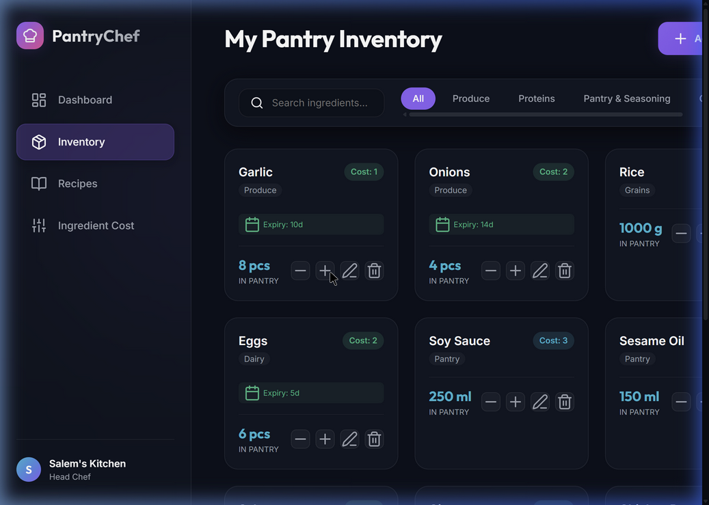
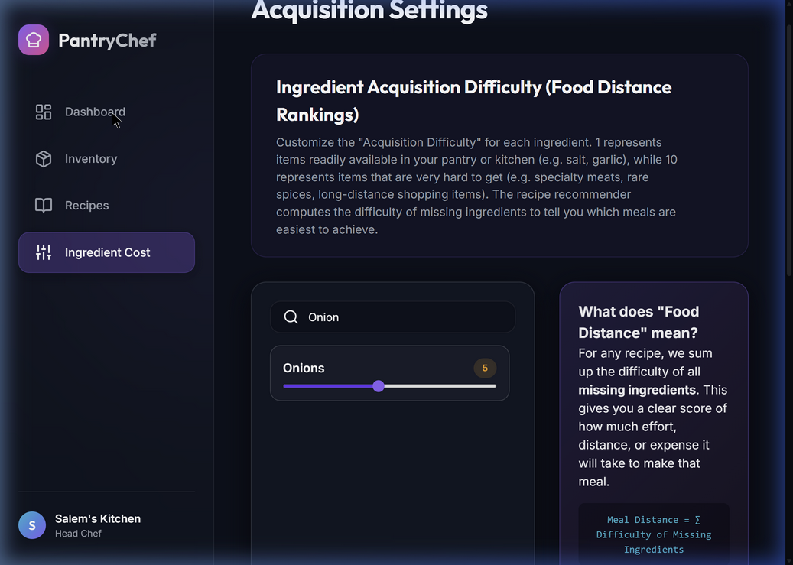

# PantryChef 🍳 — Smart Food Inventory & Recipe Recommendation App

PantryChef is a responsive single-page web application designed to help users track their pantry inventory, manage self-curated recipes, and discover the closest/easiest meals to prepare using a custom-weighted **"Food Distance"** algorithm.

Built with a premium dark-mode glassmorphism interface named **"Midnight Orchard"**, the app features glowing badges, responsive flex-grid layouts, backdrop blurs, and smooth micro-animations.

---

## 1. Core Feature Set

*   **Pantry Inventory Tracker**: Maintain quantities, custom units (e.g. grams, pieces, tbsp), categories, and expiration dates with automatic color-coded countdown warning badges.
*   **Curated Recipe Catalog**: Save recipes classified by meal styles: *Quick & Easy*, *Breakfast*, *Packed Lunch*, *Snacks*, and *Long/Multi-day*. Each includes prep times, flavor ratings, and ease-of-cooking stars.
*   **The "Food Distance" Algorithm**: Computes which unavailable recipes are closest to completion based on user-editable acquisition difficulties for missing ingredients.
*   **One-Click Cooking**: When viewing a recipe with 100% in-stock ingredients, click the "Cook Meal" action to automatically decrement the required quantities from your pantry.
*   **Interactive Modals**: Full-viewport blur dialogs for inserting ingredients, building recipes with dynamic ingredient row additions, and viewing complete step-by-step checklist details.
*   **Local Persistence**: All operations sync instantly with the browser's `localStorage` so data is preserved across sessions.

---

## 2. The "Food Distance" Concept

Instead of simple ingredient match counts, PantryChef represents cooking friction using an acquisition difficulty scale of 1 to 10:

*   **1–2 (Ubiquitous Staples)**: Salt, water, garlic, basic spices. Always on hand.
*   **3–4 (Common Groceries)**: Onions, eggs, rice, butter, milk. Easy grab.
*   **5–6 (Fresh Proteins / Produce)**: Chicken breast, fresh vegetables, fresh herbs.
*   **7–8 (Specialty Items)**: Imported condiments (e.g. Gochujang), premium seafood (salmon).
*   **9–10 (Rare / High Cost)**: Premium steaks, rare direct-farm herbs.

### Calculation Formula
$$\text{Food Distance} = \sum_{i \in \text{Missing Ingredients}} \text{Acquisition Difficulty of } i$$

For example, if you are missing Onions (difficulty 2) and Garlic (difficulty 1), the recipe's distance is **3**. If a chicken recipe is missing Chicken Breast (difficulty 6), its distance is **6**. The app automatically prioritizes the Onion & Garlic meal on your dashboard as the **closest match**, even though both recipes are missing ingredients. 

Users can tweak these ratings in the **Ingredient Cost** settings panel to match their local shopping distances, prices, or garden availability.

---

## 3. UI Overview & Walkthrough

### A. Pantry Inventory Screen
Review, search, and filter ingredients. Quickly increment/decrement quantities using the `+` / `-` controls.



### B. Acquisition Difficulty Settings
Adjust difficulty parameters using sliders. Search controls allow finding specific ingredients quickly.



---

## 4. Technical Architecture & Files

The project has a zero-dependency front-end footprint, structured as follows:

```
food app/
├── index.html         # Main app layout, modal structures, search filters, and CDN links
├── style.css          # Design tokens, glassmorphism shadows, glowing status badges, and responsive media queries
├── app.js             # LocalStorage sync, Food Distance engine, card renderers, and event hooks
└── docs/
    └── screenshots/   # Copied verification screenshots for visual reference
        ├── inventory_ui.png
        └── cost_settings_ui.png
```

---

## 5. Local Setup & Usage

To run the application locally:

1.  Open your terminal or PowerShell and navigate to the project directory:
    ```powershell
    cd "c:\Users\Salem\Documents\LOCAL REPOS\food app"
    ```
2.  Start a local HTTP server using Python:
    ```powershell
    python -m http.server 8000
    ```
3.  Open your web browser and navigate to:
    ```
    http://localhost:8000/index.html
    ```
